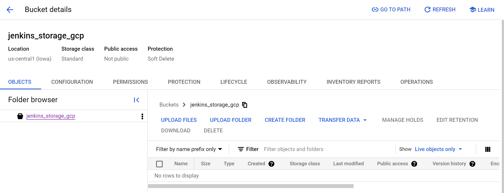
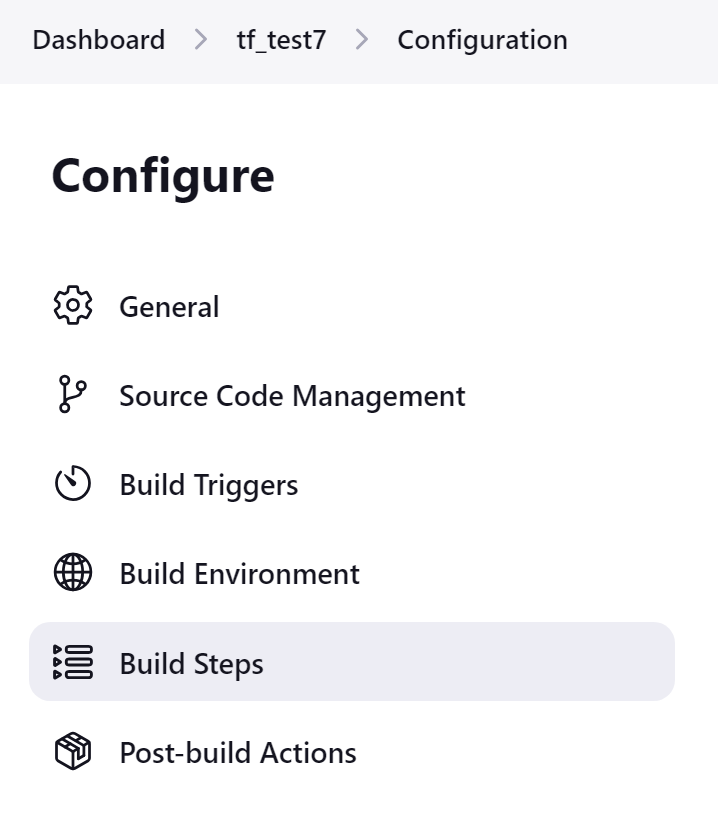
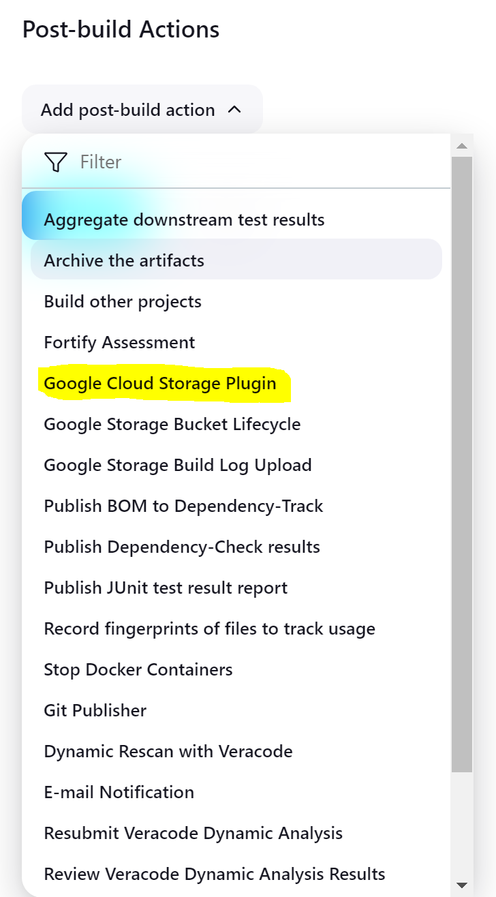
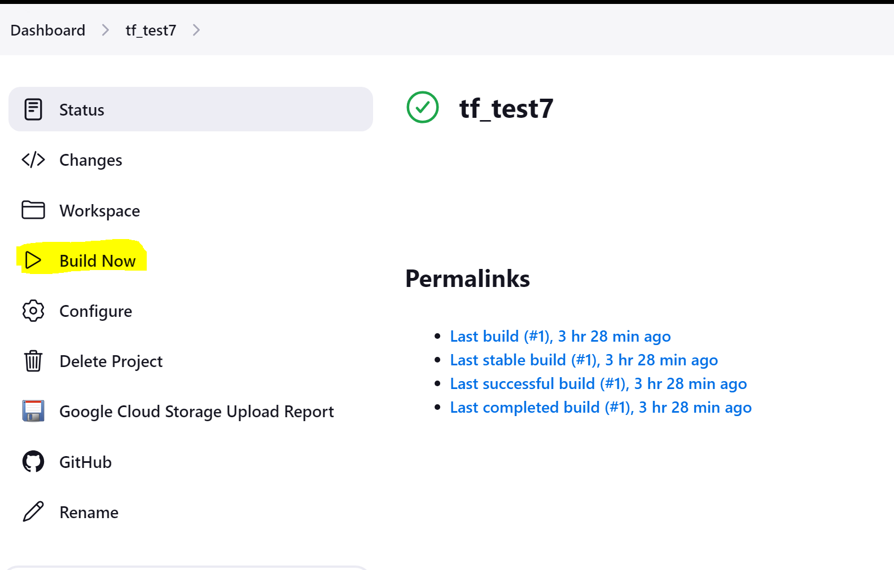
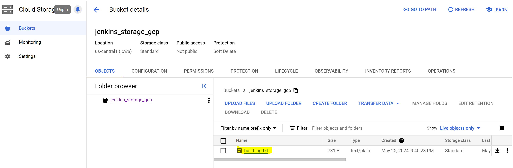
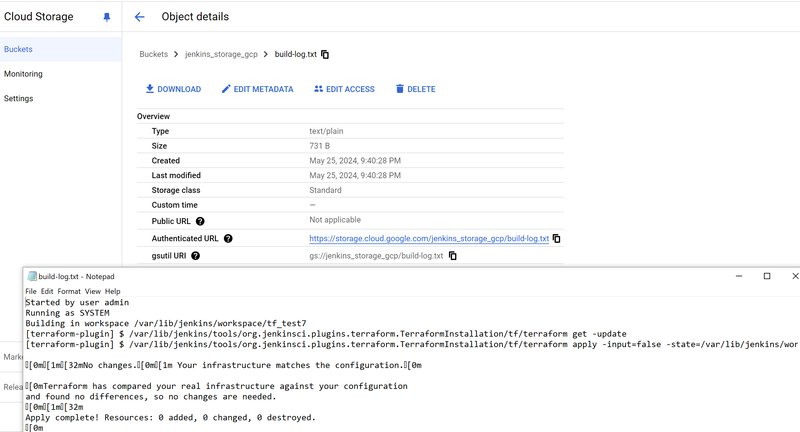

# Step-by-Step Instructions to Configure Jenkins with GCP Bucket

## Part 1: Create a GCP Bucket

### Step 1: Open Google Cloud Console

1. **Navigate to the Google Cloud Console**:
   - Open your web browser and go to the [Google Cloud Console](https://console.cloud.google.com).

### Step 2: Select or Create a Project

1. **Select or Create a Project**:
   - In the top navigation bar, click on the project dropdown.
   - Select your existing project or create a new one by clicking on **New Project** and following the prompts.

### Step 3: Go to Cloud Storage

1. **Navigate to Cloud Storage**:
   - In the left-hand navigation menu, go to **Storage** > **Browser**.

### Step 4: Create a New Bucket

1. **Create a New Bucket**:
   - Click on **Create bucket**.
   - Enter a unique name for your bucket (e.g., `your-bucket-name`).
   - Choose a **Location type** and select a **Location**.
   - Select a **Storage class**.
   - Configure **Access control** (e.g., select **Uniform**).
   - Click **Create**.

## Part 2: Configure Jenkins to Upload Build Results to GCP Bucket

### Step 1: Open Jenkins Dashboard

1. **Navigate to Jenkins**:
   - Open your web browser and go to your Jenkins instance URL (e.g., `http://your-jenkins-url/`).

### Step 2: Select Your Jenkins Job

1. **Select the Job**:
   - In the Jenkins dashboard, find and click on the job you want to configure.
   - This will take you to the job’s main page.

2. **Configure the Job**:
   - On the job’s main page, click on **Configure** on the left-hand menu.

### Step 3: Navigate to Post-build Actions

1. **General Section**:
   - The configuration page will open up in the **General** section.
   - Here, you can configure basic settings for your job such as the project description.

2. **Scroll Down to Post-build Actions**:
   - Continue scrolling down past sections such as **Source Code Management**, **Build Triggers**, **Build Environment**, and **Build Steps** until you reach the **Post-build Actions** section.

### Step 4: Add Post-build Action

1. **Add Post-build Action**:
   - Click on the **Add post-build action** button.
   - A dropdown menu will appear.

1. **Select Google Cloud Storage Upload**:
   - From the dropdown menu, select **Google Cloud Storage Plugin**.

### Step 5: Configure Google Cloud Storage Upload

1. **Bucket Configuration**:
   - **Bucket**: Select the bucket configuration you set up earlier in **Manage Jenkins** > **Configure System** (e.g., `GCS Uploader`).

2. **Source Files**:
   - **Source Files**: Enter the path to the files you want to upload. For example, to upload all JAR files, enter `**/*.jar`.

3. **Destination Path**:
   - **Destination Path**: Enter the destination path in the GCS bucket where you want the files to be uploaded. For example, you can use `builds/${BUILD_NUMBER}` to organize the files by build number.

4. **Advanced Options** (if needed):
   - Configure additional settings if necessary, such as caching control, storage class, etc.

5. **Configure Build Log Upload**:
   - **Google Credentials**: Select the Google credentials (e.g., `your-gcp-credentials`).
   - **Log Name**: Enter the name for the build log file, such as `build-log.txt`.
   - **Storage Location**: Enter the GCS bucket path, e.x., `gs://jenkins_storage_gcp`.
   - **Share Publicly**: (Optional) Check if you want the log to be publicly accessible.
   - **For failed jobs?**: (Optional) Check if you want to upload logs for failed jobs.
   - **Show inline in browser?**: (Optional) Check to view the build log inline in Jenkins.
   - **Strip path prefix?**: (Optional) Specify a path prefix to strip from the file paths before uploading.

### Step 6: Save the Configuration

1. **Add Operation**:
   - If you want to add another upload operation, click the **Add Operation** button and configure as needed.

2. **Save**:
   - After configuring the post-build action, scroll down to the bottom of the page and click on the **Save** button.

## Part 3: Running the Pipeline and Viewing Build Log Results

### Step 1: Run the Pipeline

1. **Start the Build**:
   - In the Jenkins dashboard, go to the job’s main page.
   - Click on **Build Now** on the left-hand menu to start the build process.
   - This will trigger the job, and Jenkins will start the build process.

### Step 2: Open Google Cloud Console

1. **Navigate to the Google Cloud Console**:
   - Open your web browser and go to the [Google Cloud Console](https://console.cloud.google.com).

### Step 3: Go to Cloud Storage

1. **Navigate to Cloud Storage**:
   - In the left-hand navigation menu, go to **Storage** > **Browser**.

### Step 4: Locate Your Bucket

1. **Locate Your Bucket**:
   - Find and click on your bucket (e.g., `your-bucket-name`).

### Step 5: View Uploaded Files

1. **View Files**:
   - Inside your bucket, navigate to the folder where your build logs and artifacts were uploaded (e.g., `builds/${BUILD_NUMBER}`).
   - Click on the log file (e.g., `build-log.txt`) to view its contents.
   - If you made the file publicly accessible, you can also share the URL.

By following these steps, you will have created a GCP bucket, configured Jenkins to upload build results to the bucket, and viewed the uploaded log results in GCP.
