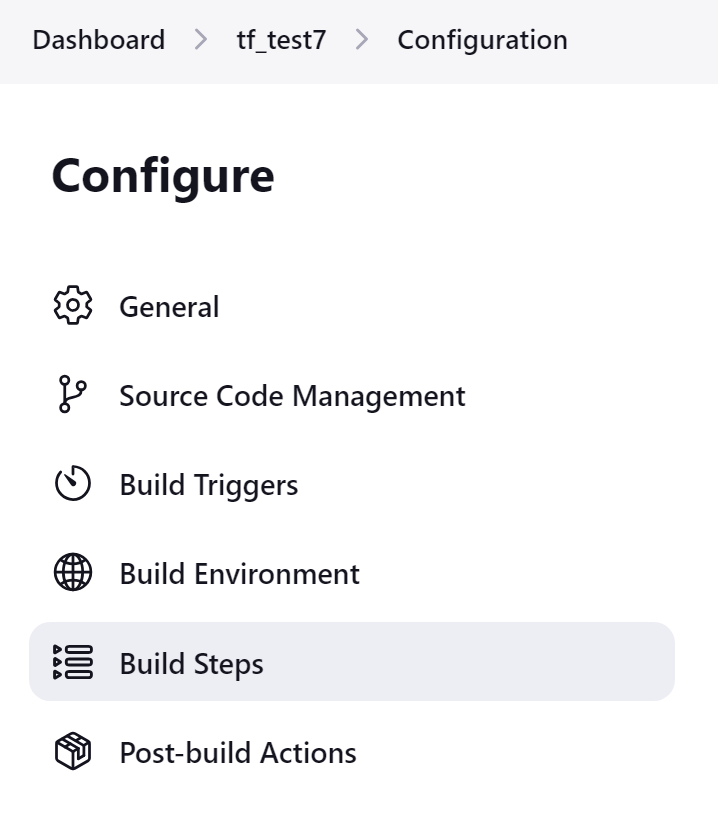
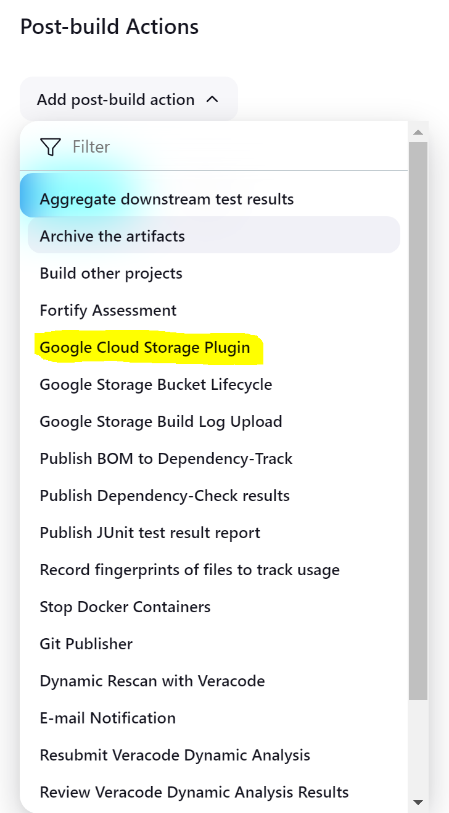
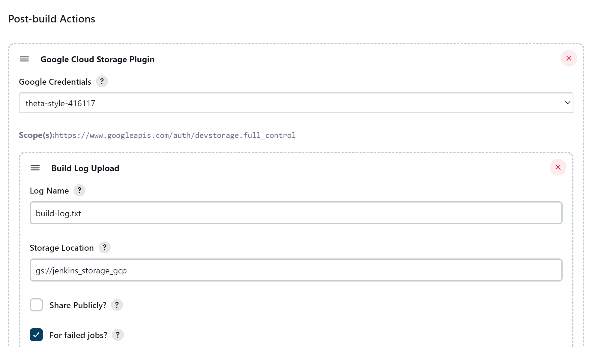

# Jenkins Server Setup Instructions

## 1. Create a VM Instance
1. Name the instance.
2. Select the region.
3. Choose the `e2-standard-2` machine type.

## 2. Boot Disk Setup
1. Select the marketplace (indicated in blue letters).
2. Search for "Jenkins" in the search bar.
3. Choose the standalone Jenkins option (no other versions).

## 3. Activate Jenkins
1. Click the blue button to activate.
2. Enable all settings if setting up for the first time.

## 4. Deploy Jenkins
1. Leave all settings as default and click the blue "DEPLOY" button.
2. Copy and paste the admin username and temporary password. Example:

## 5. Access Jenkins
1. Copy the HTTP URL.
2. Open a new tab, paste the URL in the search bar, and click "Advanced" to proceed if needed.

## 6. Log In to Jenkins
1. Enter the admin username and password in the Jenkins login page to access the Jenkins dashboard.

## 7. Configure Jenkins
1. Select "Configure a Cloud".
2. Install the necessary plugins by following the instructions below.

# Install Plugins
#### GCP Plugins
1. Go to "Manage Jenkins" -> "Manage Plugins" -> "Available".
2. Search for "GCP" and install the following:
- Pipeline: GCP Steps

#### Additional GCP Plugins
1. Search for and install the following:
- GCloud SDK
- GCR Vulnerability Scanner
- Google Compute Engine
- Kubernetes
- Google Metadata
- Google Cloud Storage
- Google Kubernetes Engine
- Google Authenticated Source
- Google Analyze Code Security

#### Git Plugins
1. Search for and install the following:
- GitHub API
- GitHub
- GitHub Branch Source
- Git server
- Git Parameter
- GitLab Authentication
- GitHub Integration
- Pipeline: GitHub
- Pipeline GitHub Notify Step
- GitHub Checks
- Git Push

#### OWASP Plugins
1. Search for and install the following:
- OWASP Markup Formatter
- OWASP Dependency-Check
- OWASP Dependency-Track
- ZAP Pipeline

#### Security Plugins
1. Search for and install the following:
- IBM Security AppScan Source Scanner
- IBM Security AppScan Standard Scanner
- MFA/Two-Factor-Authentication (2FA)
- HCL AppScan
- Extended Security Settings
- OpenID Connect Provider
- Aqua Security Scanner
- OpenShift Login
- SAML Single Sign-On (SSO)
- Fortify
- Snyk Security
- Google Login
- Mask Passwords
- Authorize Project
- PAM Authentication

#### Terraform Plugins
1. Search for and install the following:
- Terraform

#### Azure Plugins
1. Search for and install the following:
- Azure SDK API
- Azure Credentials
- Azure Key Vault

#### Docker Plugins
1. Search for and install the following:
- Docker
- Docker Commons
- Docker Pipeline
- Google Container Registry Auth
- Aqua MicroScanner
- CrowdStrike Security
- Panoptica Vulnerability Scanner

#### SAST Plugins
1. Search for and install the following:
- Sken.ai
- CodeThreat

#### DAST Plugins
1. Search for and install the following:
- Breachlock DAST

#### Veracode Plugins
1. Search for and install the following:
- Veracode Scan

#### MSBuild Plugins
1. Search for and install the following:
- MSBuild

#### Machine Learning Plugins
1. Search for and install the following:
- Machine Learning

## 8. Configure a New Cloud
1. Go to "Manage Jenkins" -> "Configure System" -> "Clouds" -> "New Cloud".
2. Name the cloud (e.g., `gcp2`).
3. Select "Google Compute Engine".
4. Input Project ID.
5. Add credentials:
- Click "Add" -> "Jenkins" -> "Google service account from private key".
- Select the JSON key file for the service account.
- Add Project ID in the "Project Name" field.
6. Click "Add" to finish the setup.

## 9. Create a New Item
1. Go to "New Item".
2. Enter the name and select "Pipeline".
3. Click "OK".

## 10. Configure the Pipeline
1. Under "Definition", select "Pipeline script".
2. Enter the script (e.g., "Hello World").
3. Click "Apply" and "Save".

## 11. Build the Pipeline
1. Click "Build Now".

## 12. Create a New Freestyle Project
1. Go to "New Item".
2. Enter the name and select "Freestyle project".
3. Click "OK".
4. In the configuration:
- Select "GitHub project".
- Enter the repository link in the "GitHub project" field.
- Under "Source Code Management", select "None".
5. Configure Terraform installation if needed:
- Go to "Manage Jenkins" -> "Global Tool Configuration".
- Scroll to the bottom to configure Terraform installation.
6. Click "Apply" and "Save".
7. Click "Build Now".

## Additional Resources
- Jenkins Getting Started: [Jenkins Documentation](https://www.jenkins.io/doc/book/getting-started/)
- Example Jenkins URL: [Jenkins Server](https://34.165.2.253/)
- Presentation: [Setup Guide](https://docs.google.com/presentation/d/1WNKrapKzDmDvUDSC0lBQmsOxtvMtsTDvv0beb1Aou5w/edit#slide=id.g2df1b485b84_0_115)

